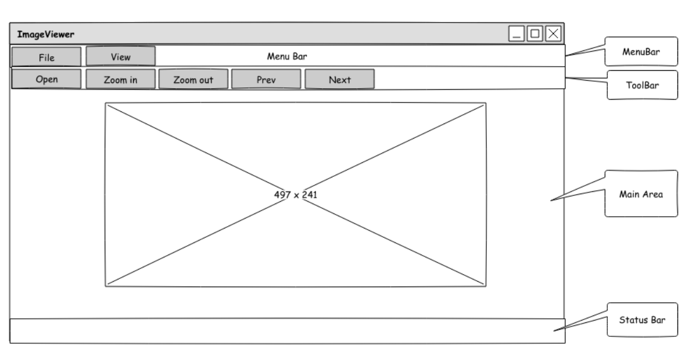

#       QT notes


## 1. Build project
+ Command lines:
$ qmake -makefile
$ make 

## 2. Design UI using mainwindow.h
+ Khai bao thanh phan trong file *mainwindow.h*.
    - Design elements in *class MainWindow*:



    ```
    private:
        QMenu *fileMenu;
        ...

        QToolBar *fileToolBar;
        ...
        // to display image
        QGraphicsScene *imageScene;
        QGraphicsScene *imageView;
    ```